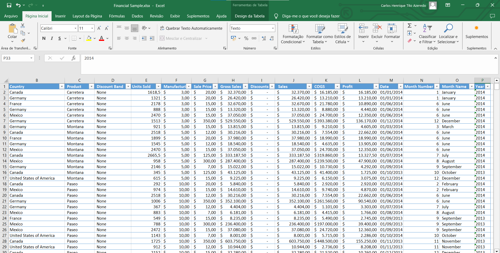
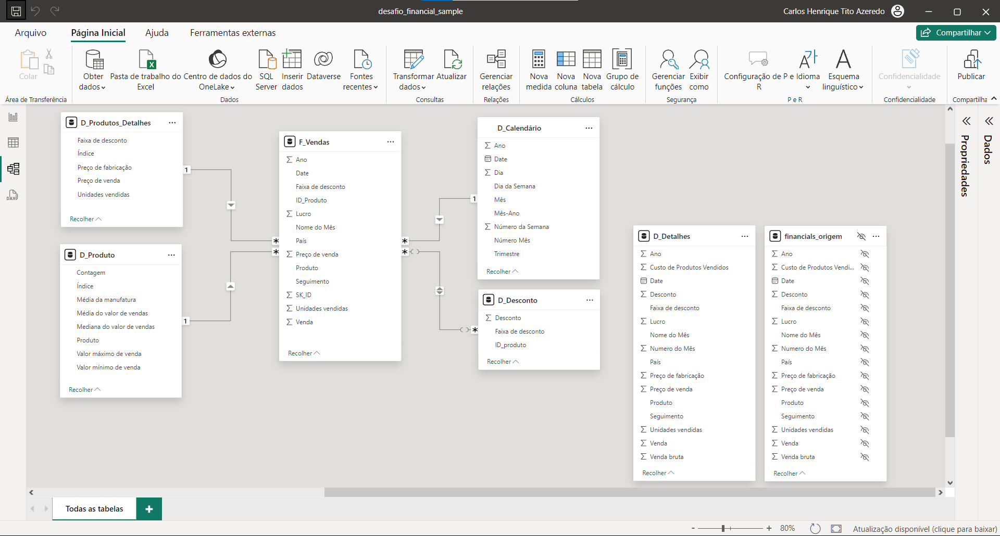

# Quinto Desafio de Projeto 
Objetivo:

Utilizaremos a tabela única de Financial Sample para criar as tabelas dimensão e fato do nosso modelo baseado em star schema.
O processo consiste na criação das tabelas com base na tabela original. A partir da cópia serão selecionadas as colunas que irão compor a visão da nova tabela.

# Tabela origem

# Tabelas - Star Schema

