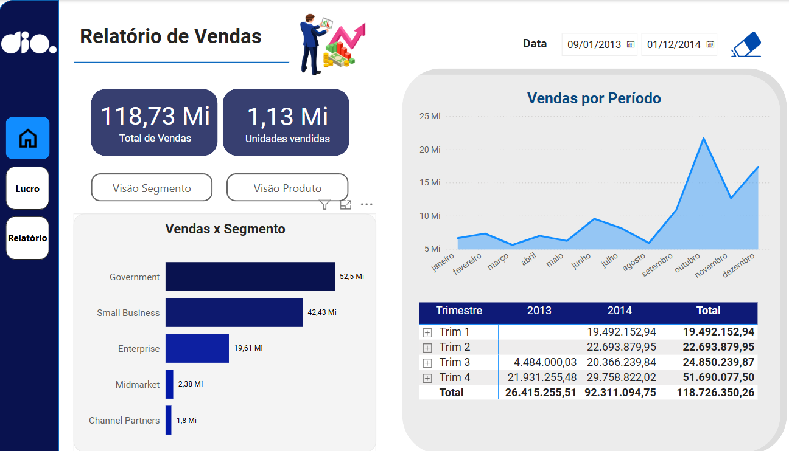
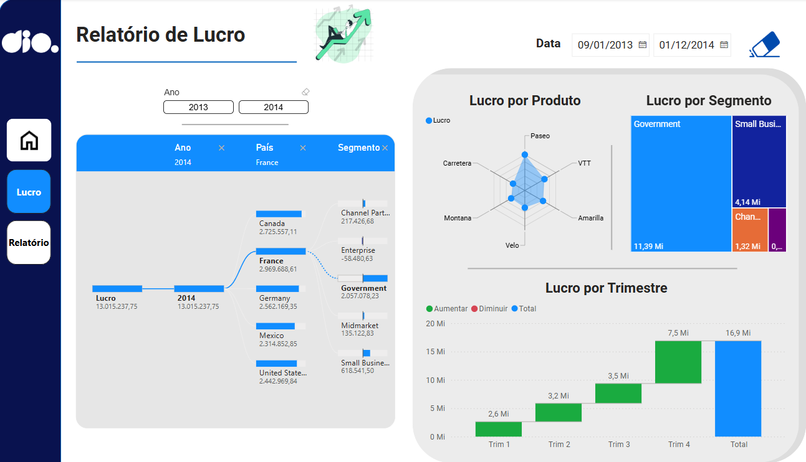
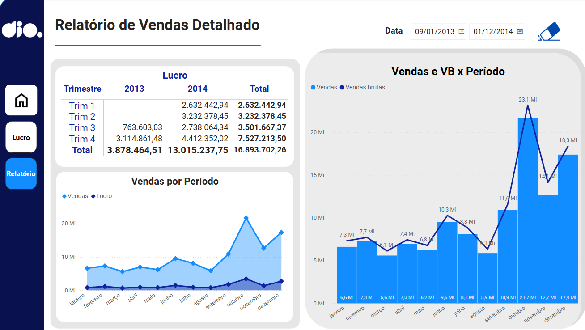

# Sexto Desafio de Projeto 
Objetivo:

Criar um relatório com foco na experiência do usuário, foi levado em consideração os seguintes pontos:
- Posicionamento
- Contraste
- Proporção áurea
- Segmentação dos dados

# Tela de vendas

# Tela de lucro

# Tela de relatório

