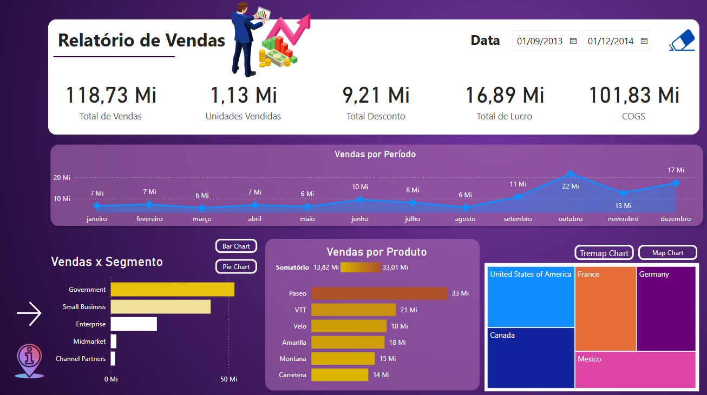
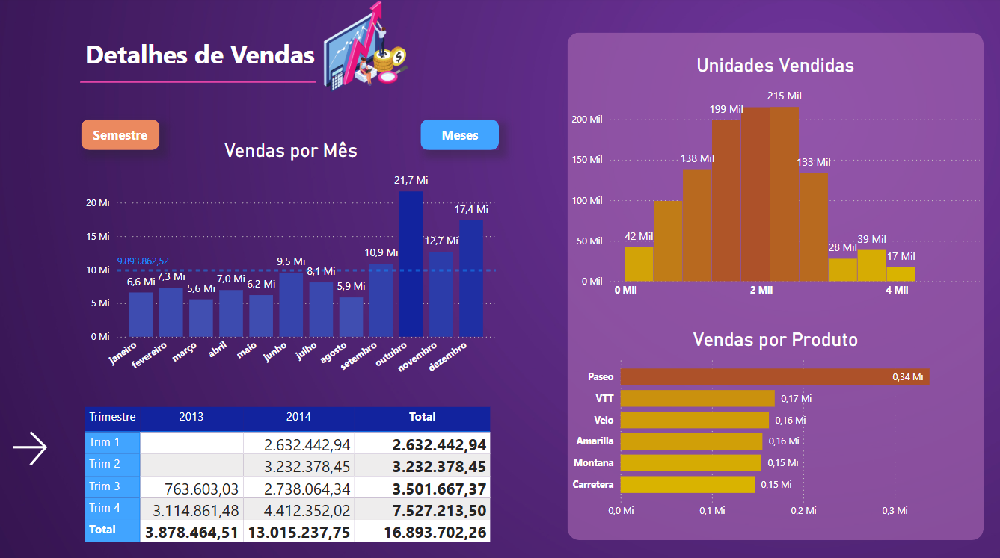
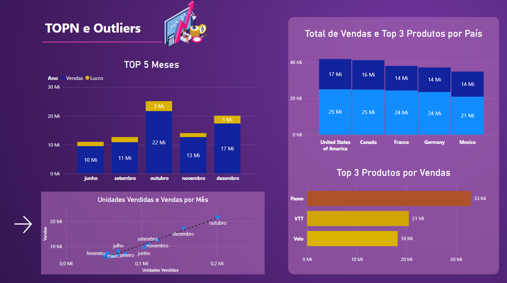
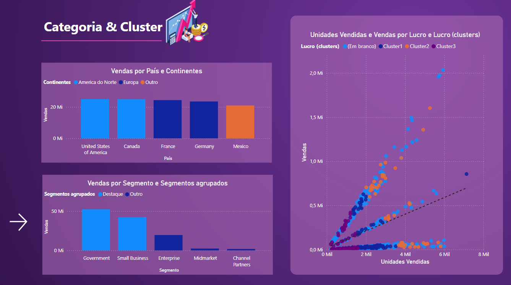

# 🧩 Sétimo Desafio de Projeto

### 🎯 Objetivo  
Criar um **relatório de vendas**, considerando os seguintes pontos:

## ✅ Pontos a serem considerados

- Criar a página de **detalhes**, conforme apresentado no desafio de projeto.  
- Pensar na **disposição dos visuais**, focando na experiência de consumo do cliente.  
- A quantidade de páginas pode variar de acordo com os visuais utilizados (limite de até **duas páginas**).  
- Criar todas as **medidas necessárias** para os visuais.

## 📊 Visuais sugeridos para o relatório

- **TOP 3 Produtos** em desempenho.  
- **Principais países** em termos de vendas, lucro (*profit*) ou outra métrica relevante.  
- **Gráfico de dispersão**: Unidades Vendidas × Vendas por mês.  
- Visuais de **agrupamento de dados** (clusters, segmentações, etc.).  
- Visuais de **compartimentação dos dados** (como hierarquias ou filtros dinâmicos).

# Tela Home

# Tela Principal

# Tela Detalhes

# Tela TOPN e Outliers

# Tela Categoria & Cluster

