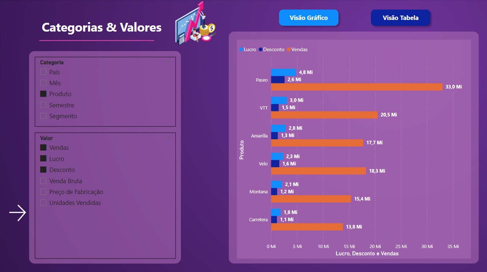
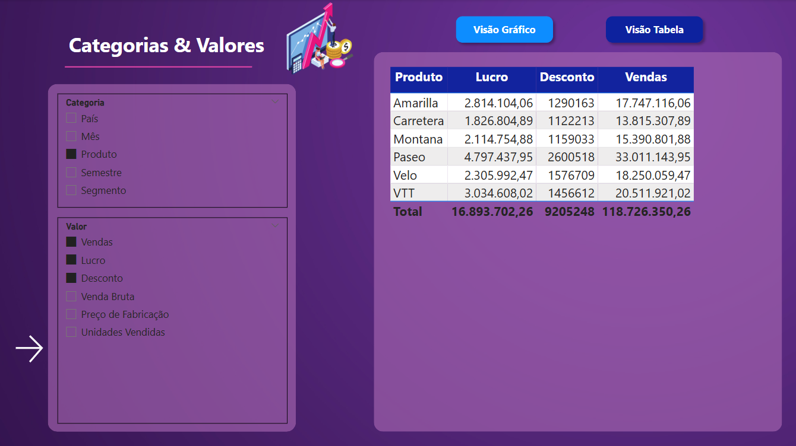

# 🧩 Oitavo Desafio de Projeto

### 🎯 Objetivo  
Criar pelo menos dois visuais considerando a criação de parâmetros.

## ✅ Pontos a serem considerados

- Primeira visão: parâmetro com base em categorias.
- Segunda visão: parâmetros com base em valores (profit, sales, ou outros).
- Seguir a mesma estilização do relatório.
- Criar uma história para apresentar essa visão sobre os dados.

# Tela Categoria & Valores (Visão Gráfico)

# Tela Categoria & Valores (Visão Tabela)

